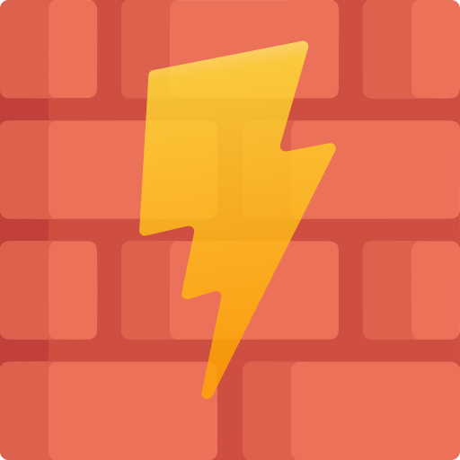
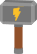

### Hi there 👋
### 始めまして『エバンズ『です 👋

__Developing an [open source game engine](https://github.com/wtfsystems) - check it out!__

__Creator of [Script Tray](https://github.com/AtomicSponge/script-tray/#readme) - a script launching system utility!__

### NPM Repository (Scripts & Libraries):
- https://www.npmjs.com/~spongex

### About me:
- Learned [QBasic](https://en.wikipedia.org/wiki/QBasic) & [C](https://en.wikipedia.org/wiki/The_C_Programming_Language) on an [IBM PS/1](https://en.wikipedia.org/wiki/IBM_PS/1) [Intel i386](https://en.wikipedia.org/wiki/I386) :computer:
- Likes to modify [old](https://en.wikipedia.org/wiki/TurboGrafx-16) [video](https://en.wikipedia.org/wiki/Super_Nintendo_Entertainment_System) [game](https://en.wikipedia.org/wiki/Sega_Saturn) [consoles](https://en.wikipedia.org/wiki/Nintendo_Entertainment_System) and built a [SuperGun](https://en.wikipedia.org/wiki/SuperGun) :space_invader:
- Loves [MIDI](https://en.wikipedia.org/wiki/MIDI) and thinks [GameBoys](https://en.wikipedia.org/wiki/Game_Boy) are musical instruments.  :musical_keyboard:
- [Cheats](https://imhex.werwolv.net/) at video games :expressionless:
- [A](https://en.wikipedia.org/wiki/Mobile_Suit_Gundam)[ni](https://en.wikipedia.org/wiki/Neon_Genesis_Evangelion)[me](https://typemoon.fandom.com/wiki/Fate_series) [fan](https://en.touhouwiki.net/wiki/Touhou_Wiki) :heart:
- Self educated :nerd_face:

### Tech used:

&nbsp;&nbsp;

&nbsp;&nbsp;

&nbsp;&nbsp;

&nbsp;&nbsp;

&nbsp;&nbsp;

&nbsp;&nbsp;

